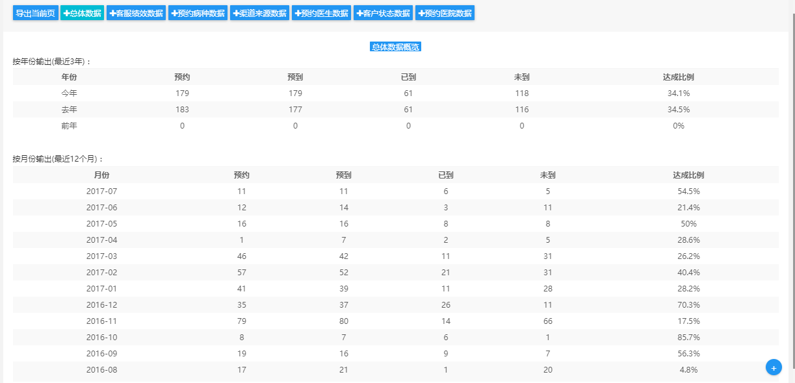

# Task

1. ~~将advistory doctor disease age 移到折叠栏中~~

2. ~~折叠栏中加入advistory doctor disease mark frist~~

3. ~~添加price统计栏~~

4. ~~如果选择 确认已到 状态则自动填充到达时间至sql~~

5. ~~添加表格排序功能 可选参数（sex， 各种date，first？）~~

6. ~~添加patient表单 加入选择登记人选项 加入 first~~

7. ~~添加月排行榜模块 （预约排行TOP, 实到排行TOP, 流失数量TOP, 回访数量TOP）~~

8. ~~添加分组数据表格~~ 

9. 添加绩效数据表格 