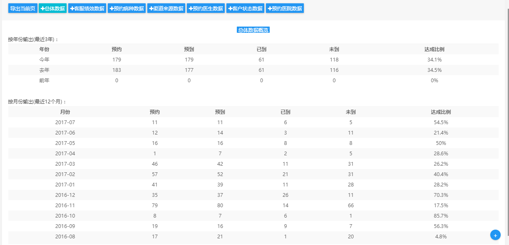
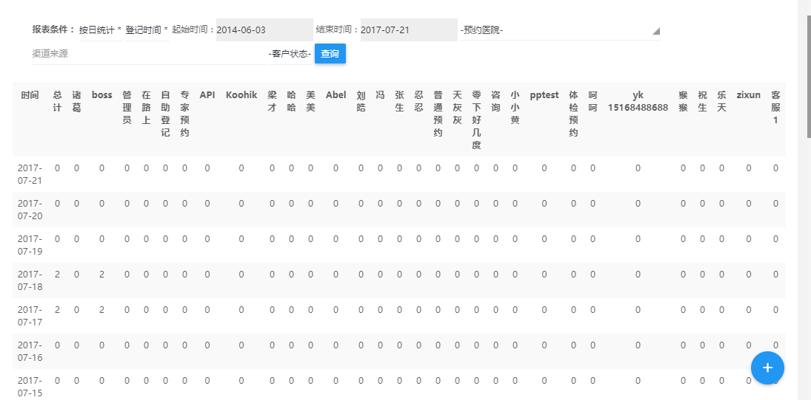
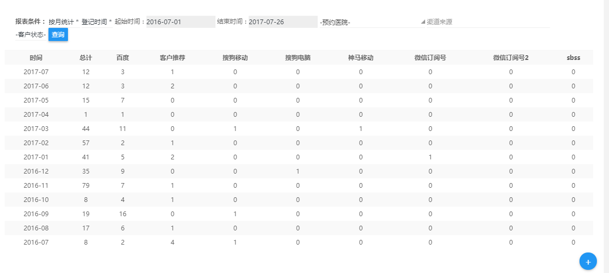
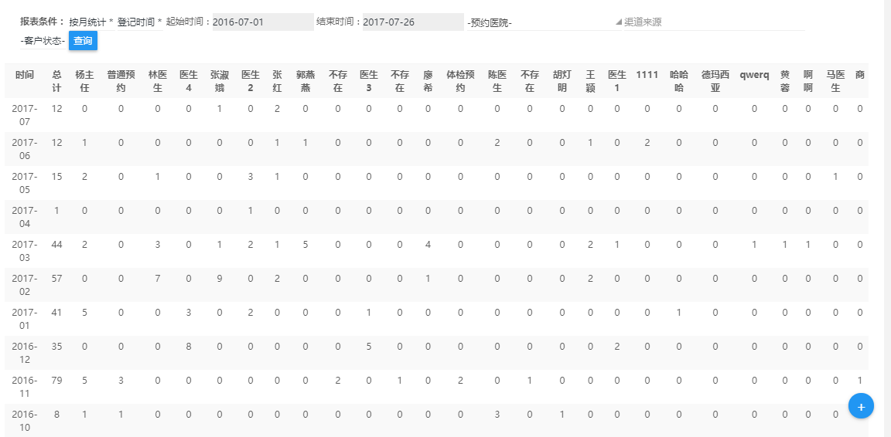
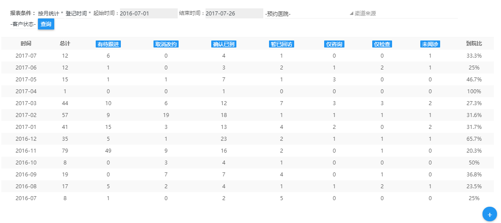
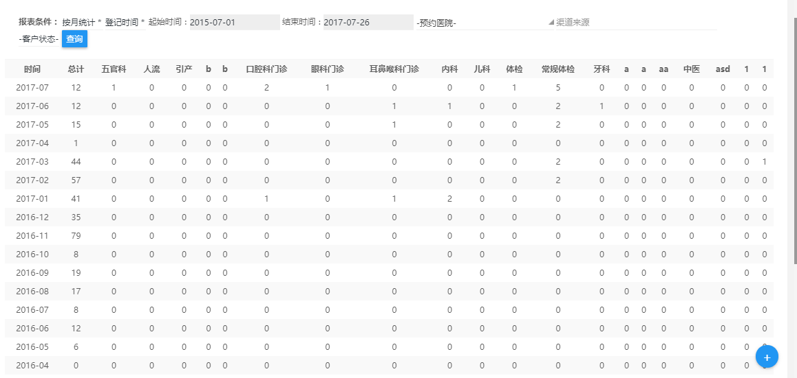

# Todo List

- ~~将advistory doctor disease age 移到折叠栏中~~

- ~~折叠栏中加入advistory doctor disease mark frist~~

- ~~添加price统计栏~~

- ~~如果选择 确认已到 状态则自动填充到达时间至sql~~

- ~~添加表格排序功能 可选参数（sex， 各种date，first？）~~

- ~~添加patient表单 加入选择登记人选项 加入 first~~

- ~~添加月排行榜模块 （预约排行TOP, 实到排行TOP, 流失数量TOP, 回访数量TOP）~~

- ~~将新的menu数据更新到seed中~~

- 完善错误处理 (patient)

- ~~patient 页面翻页 添加loading动画~~

+ 添加绩效数据表格 
  - ~~总体数据 (以月份输出和以年份输出)~~
   

  - ~~客服数据 报表条件(状态：4个基本状态)(统计类型：按年，月，日)~~
   

   - ~~渠道数据 报表条件(状态：4个基本状态)(统计类型：按年，月，日)~~
   

   - ~~医生数据 报表条件(状态：4个基本状态)(统计类型：按年，月，日)~~
   

   - ~~客户状态数据 报表条件(状态：4个基本状态)(统计类型：按年，月，日)~~
   

   - 病种数据 报表条件(状态：4个基本状态)(统计类型：按年，月，日)
   